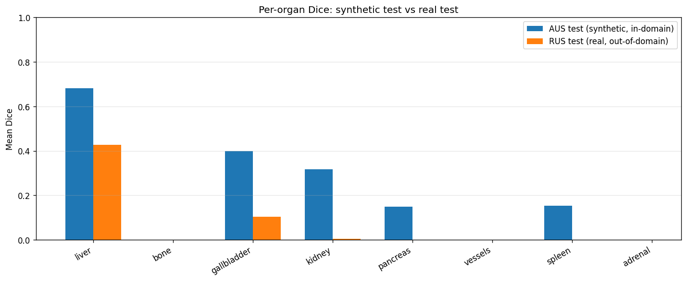

# Multi-Organ Abdominal Ultrasound Segmentation with MONAI

A two-notebook tutorial for the [MONAI Ultrasound Working Group](https://github.com/Project-MONAI/wg-ultrasound), demonstrating multi-class organ segmentation on the [AbdomenUS dataset](https://www.kaggle.com/datasets/ignaciorlando/ussimandsegm). The tutorial walks through a baseline implementation, identifies a real failure mode (mode collapse onto the dominant class), and shows the fix (class-weighted loss).

**Author:** Lakshmi Mahabaleshwara

---

## What's in this folder

| File | Purpose |
|---|---|
| `abdomen_us_v1_baseline.ipynb` | V1 baseline. Plain `DiceCELoss`. Demonstrates mode collapse onto liver. |
| `abdomen_us_v2_class_weighted.ipynb` | V2 fix. Class-weighted `DiceCELoss`. Recovers five organs from 0.0 Dice. |
| `requirements.txt` | Python dependencies for non-Kaggle environments. |
| `results/` | Per-organ Dice plots and prediction visualizations from sample runs. |

The two notebooks are nearly identical. They share the same data pipeline, model, training loop, and evaluation. They differ in exactly one cell — the loss definition in §8.

---

## Results

Trained on 510 synthetic ultrasound images (AUS), validated on 130 held-out subjects, tested on 280 synthetic + 60 real (RUS) images. Single MONAI 2D UNet, ~75 minutes of T4 GPU time per run.

| Class | V1 baseline AUS | V2 class-weighted AUS | V1 baseline RUS (real) | V2 class-weighted RUS (real) |
|---|---|---|---|---|
| **liver** | 0.689 | 0.687 | 0.459 | 0.422 |
| bone | 0.000 | 0.000 | NaN¹ | NaN¹ |
| **gallbladder** | 0.000 | **0.551** | 0.000 | **0.178** |
| **kidney** | 0.094 | **0.337** | 0.000 | 0.000 |
| **pancreas** | 0.000 | **0.170** | NaN¹ | NaN¹ |
| vessels | 0.000 | 0.000 | 0.000 | 0.000 |
| **spleen** | 0.008 | **0.258** | 0.000 | 0.000 |
| adrenal | 0.000 | 0.000 | NaN¹ | NaN¹ |
| **Mean (foreground)** | **0.087** | **0.250** | — | — |

¹ NaN means the class has no annotated pixels in any RUS test image — the dataset's RUS test set doesn't include those organs, so Dice is undefined.

**The headline:** V1 collapsed onto liver. V2 recovered gallbladder, kidney, pancreas, and spleen — without sacrificing liver performance. Mean foreground Dice nearly tripled (0.087 → 0.250). Three classes (bone, vessels, adrenal) remain at 0.0 because they're too rare in the training data even with up-weighting; addressing them would require sampling-strategy changes beyond the scope of this tutorial.

---

## How to run

### On Kaggle (recommended, easiest)

1. Sign in to [kaggle.com](https://kaggle.com) (free account).
2. Open the notebook of choice in Kaggle's notebook editor (File → Upload Notebook).
3. In the right sidebar, click **+ Add Data** and search for `ussimandsegm`. Add the dataset by Ignacio Orlando.
4. In the right sidebar's **Notebook options**, switch the accelerator to **GPU T4 x2** and toggle **Internet** ON (one-time phone verification required for internet).
5. Run All. Expected runtime: ~75 minutes per notebook.

### On Google Colab

1. Open Colab and `File → Upload notebook`.
2. Set runtime to GPU: `Runtime → Change runtime type → T4 GPU`.
3. Set up Kaggle API credentials so `kagglehub` can download the dataset:
   - Get your Kaggle API token from your Kaggle account settings (`kaggle.json`).
   - In Colab, run: `from google.colab import userdata; os.environ['KAGGLE_USERNAME'] = userdata.get('KAGGLE_USERNAME'); os.environ['KAGGLE_KEY'] = userdata.get('KAGGLE_KEY')` after adding them to Colab's "Secrets" panel.
4. Run All.

### Locally

1. Set up Python ≥3.10 with PyTorch ≥2.0 (CUDA recommended). Follow the [PyTorch install instructions](https://pytorch.org/get-started/locally/) for your platform — `pip install torch` alone often gets you the CPU-only build.
2. Install other dependencies: `pip install -r requirements.txt`
3. Either:
   - Set environment variable `ABDOMEN_US_ROOT=/path/to/abdominal_US/abdominal_US`, OR
   - Place the dataset at `./data/abdominal_US/abdominal_US/`, OR
   - Configure Kaggle API credentials and let `kagglehub` download.
4. Open the notebook in Jupyter and Run All.

### Quick verification mode

Both notebooks have a `TUTORIAL_MODE` flag at the top of §2. Set it to `True` for a fast pipeline check (5 epochs on 30% of data, ~10 minutes on T4). Set it to `False` for a real training run (50 epochs, full data, ~75 minutes).

---

## What you'll learn

1. **Config-driven notebook design.** A single `Config` dataclass drives every parameter. Forking for a different dataset means editing one cell, not 20.
2. **Manifest-first data engineering.** A pandas DataFrame is the single source of truth for paths, splits, and metadata — making subject-grouped splitting, EDA, and stratified evaluation trivial.
3. **Subject-grouped splits.** The #1 source of overstated results in medical imaging is patient leakage between train and test. We use `GroupShuffleSplit` with `groups=subject_id` and a defensive assertion to prevent it.
4. **MONAI dictionary transforms.** Image-mask pairs stay synchronized through augmentation, eliminating a common silent-bug class.
5. **The mode-collapse failure mode and its fix.** V1 demonstrates the problem (liver dominates, other organs go to 0.0); V2 demonstrates the fix (`weight=class_weights` in `DiceCELoss`).
6. **Per-class evaluation discipline.** Reporting only mean Dice would have hidden V1's mode collapse entirely. Per-class Dice, stratified by test set (synthetic vs real), is what makes the failure visible and the fix verifiable.
7. **Honest reporting of limitations.** V2 didn't fix everything — three classes remain at 0.0 Dice. The tutorial reports this directly rather than glossing over it.

---

## Recommended reading order

If you're new to MONAI or medical segmentation, read V1 first. The mode-collapse story makes V2's contribution concrete. If you're experienced and just want the working pipeline, V2 is self-contained.

In each notebook, every code cell has a markdown block above it explaining *what the cell does* and *why it's written that way*. The audience assumption is: comfortable with Python, learning ML/MONAI concepts.

---

## Limitations!

This is a tutorial, not a clinical baseline. Specifically:

- **No labeled real-ultrasound training data exists in this dataset.** We train on synthetic (AUS) and report real-world (RUS) performance as the honest measurement of transferability.
- **Three organ classes remain at 0.0 Dice even after class weighting.** Bone, vessels, and adrenal are too rare in the training data. A production model would need oversampling, copy-paste augmentation, or a different sampling strategy.
- **No domain adaptation between synthetic and real.** The dataset includes an `aus2rus/` folder with CycleGAN translation models; using those is a natural follow-up.
- **2D only.** Real abdominal ultrasound is video; this tutorial treats frames independently.
- **Single GPU, modest model.** ~2M parameters, T4-sized. Production setups would use larger models and multi-GPU training.

---

## Citation

If you use this dataset, cite the original paper:

> Vitale S, Orlando JI, Iarussi E, Larrabide I. *Improving realism in patient-specific abdominal ultrasound simulation using CycleGANs.* International Journal of Computer Assisted Radiology and Surgery 15(2):183–192, 2020.

If you use this tutorial in your work, citing this folder URL inside the WG repository is appreciated.

---

## Acknowledgements

Dataset: Vitale et al., Pladema Institute, UNICEN, Argentina. Released under a Creative Commons license after winning a Kaggle Open Data Research Grant.

Community Kaggle notebook reference (used to confirm on-disk layout and mask color encoding): *Abdominal Ultrasound Segmentation using U-NET* by `darsh22blc1378` on Kaggle.

This tutorial was developed for the [MONAI Ultrasound Working Group](https://github.com/Project-MONAI/wg-ultrasound), `data_and_tutorials` series.

---

## License

Apache License 2.0, matching the MONAI Consortium's licensing for the WG repository.
